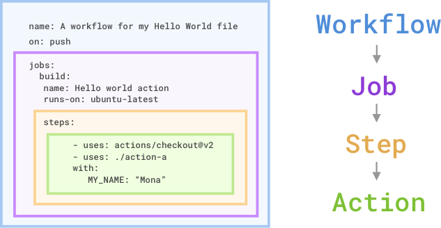
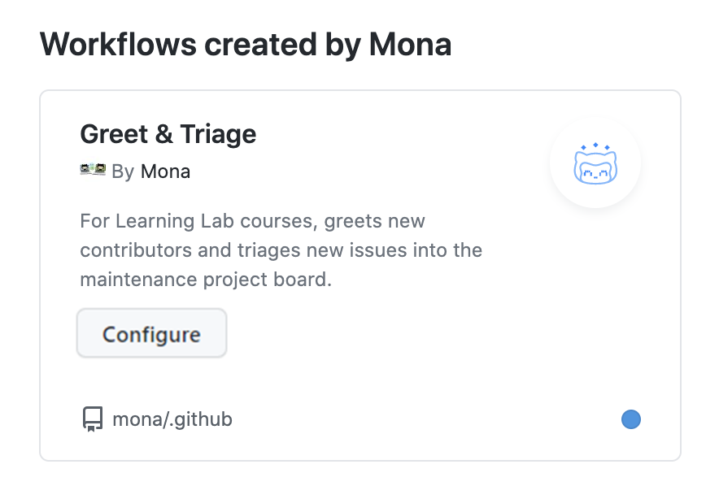

# GitHub Actions CI

## GitHub Actions Structure
The picture below explains how Github Actions workflow components are working together.



To simplify what happens in the picture above:
`An event triggers the workflow, which contains the job. The job contains the steps. The steps contain the actions.`

A GitHub Actions workflow is a process that user sets up in repository to automate software-development lifecycle tasks. In order to create a workflow, user should add actions to a `.yml` file in the `.github/workflows` directory of the repository. The basic syntax of setting up an action would look like following:

```yml
    name: A workflow for my Hello World file
    on: push
    jobs:
      build:
        name: Hello world action
        runs-on: ubuntu-latest
        steps:
        - uses: actions/checkout@v1
        - uses: ./action-a
          with:
            MY_NAME: "Mona"
```

- `on:` attribute is a trigger to specify when the workflow will run. In example above workflow executes on `push` event. 
- `jobs:` attribute is a section that contains different jobs. 
- `build:` is a name of the job. And it usually contain `name`, `runs-on` and `steps` attributes.
- `steps:` attribute is a section that contains the action steps. 
- `uses:` attribute is a reference to the action. 
- `with:` attribute is a section that contains the inputs for the action.

####    Workflow
A workflow is an automated process that you add to your repository. A workflow `needs` to have at least <b>one</b> job and can be triggered by different <b>events</b>.

####    Jobs
The job is the first major component within the workflow. Job is a section of the worklfow that will be associated with a runner. A runner can be both: `GitHub-hosted` or `self-hosted`, and job can run on a `machine` or in `container`. The runner can be specified using `runs-on` keyword.

####    Steps
A step us an individual task that can run commands in a job.

####    Actions
The actions are the standalone commands inside the workflow. These commands can reference GitHub actions such as using custom or community actions.

## Control your Workflow

It is possible to desable the workflow. It can be stopped from beign triggered though GitHub or REST API. Disabling a workflow can be usiful in situations like:
  
  - Workflow is producing a critical error
  - Temporarily pause the workflow due to low priority level and resource consuming
  - Workflow is sending requests to a service that is down
  - While working on a fork and all the functionality is unnecessary. 

In order to cancel a workflow run that is in progress, developers can use GitHub UI from the Actions tab or GitHub API endpoint `DELETE /repos/{owner}/{repo}/actions/runs/{run_id}`.

## Organization's templated workflow
GitHub Actions allows organizations to build and maintain workflows for their own needs by creating and reusing workflow templates which supports organization needs. This templates should be defined in organization's `.github` repository. Any member and repository within the organzation can have an access to these organization workflow templates. Those workflows can be found by navigating to the `Actions` tab, selecting `New workflow`, and finding the organization's workflow template section titled "Workflows created by `<organization name>`". For example, the organization called Mona has a template workflow as shown below.



