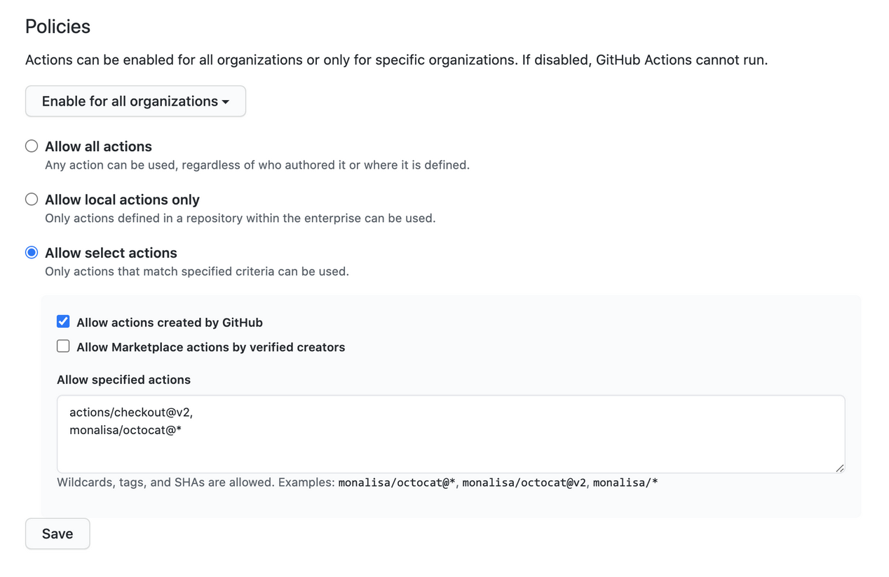

# Action and Workflows

## Enterpise Level

- It is possible to configure a `GitHub Actions use policy` at this level. The admin can set policies so that there is a limited possibility to use possibly malicious third party actions. This can be configired out of the box using both GitHub Enterprise Cloud & Server.
In order to configure a `GitHub Actions use policy` for enterprise, navigate to enterprise account and then to Policies > Actions in the sidebar. The options presented below should appear:


The option are:

1. Allow all actions
2.  Allow only local actions (in the enterprise repositories)
3.  Set a more specific criteria for the actions
4.  Disallow Actions altogether


For option 3 there are more available customizations:


- It can be narrowed down to ONLY actions created by GitHub, by verified creators, or by list of actions are allowed to use.

## Manually sync public actions for Enterprise Server
Most official GitHub-authored actions come automatically bundled with Enterprise Server, and are captured at a point in time from the GitHub Marketplace. They include `actions/checkout`, `actions/upload-artifact`, `actions/download-artifact`, `actions/labeler` and various actions/setup- actions, among others. To see all the official actions included on enterprise instance, browse to the actions organization on instance: https://HOSTNAME/actions.

It's also possible to connect the Enterprise Server to the GitHub marketplace to get new ones. However, if it must to retain control over that actions on instance, it is preferable to use the actions-sync tool to manually download actions and enable them in enterprise instance.

## Organization Level

Creating a GitHub Actions workflow often involves writing multiple files and creating several repositories to specify the workflow in itself, as well as the actions, containers and/or runners to use in the workflow. Depending on the number of users in Enterprise Cloud or Enterprise Server instance, things can get messy, if there is no corporate standards in place for creating GitHub Actions workflows.

GitHub recommends to have certain criteria for mananaging how organization does its actions. There should be a repository for this with a GitHub wiki or a markdown file. It should be available for everyone within an organization. Repository should contain:

- Repositories for storage
- Files/folders naming conventions established
- Location of shared components
- Plans for ongoing maintenance
- Contribution guidlines

## Create workflow templates
- Both in Enterprise Cloud and Server, users with write access to an organization's `.github` repository can create workflow templates that will be available for use to the other organization's members with the same write access. 

- Workflow templates can then be used to create new workflows in the `public` and `private` repositories of the organization. This ensures consistency in the practices and, by proxy, in quality.

To create a template:

1. Create a `.yml` workflow file
2. Create a `.json` metadata file that describes how the template is presented to users when they are creating a workflow. <b>`NOTE`</b>: <b> The metadata file must have the same name as the workflow file. Instead of the `.yml` extension, it must be appended with `.properties.json`. For example, a file named `octo-organization-ci.properties.json` contains the metadata for the workflow file named `octo-organization-ci.yml`.</b>
3. Place files in a public `.github` repository and in a directory `workflow-templates`.

This is what it might look like:

```yml
name: Octo Organization CI

on:
  push:
    branches: [ $default-branch ]
  pull_request:
    branches: [ $default-branch ]

jobs:
  build:
    runs-on: ubuntu-latest

    steps:
      - uses: actions/checkout@v2

      - name: Run a one-line script
        run: echo Hello from Octo Organization
```

Note that the above file uses a `$default-branch` placeholder. When a workflow is created using template, this placeholder is automatically replaced with the name of the repository's default branch.

Below is the metadata file that workflow file requires:
```json
{
    "name": "Octo Organization Workflow",
    "description": "Octo Organization CI workflow template.",
    "iconName": "example-icon",
    "categories": [
        "Go"
    ],
    "filePatterns": [
        "package.json$",
        "^Dockerfile",
        ".*\\.md$"
    ]
}
```
Metadata files use the following parameters:

| Parameter | Description | Required |
|-|-|-|
| name | Name of the workflow template displayed in the list of available templates | Yes |
| description | Description of the workflow template displayed in the list of available templates| Yes |
| iconName    | Defines an icon for the workflow's entry in the template list. Must be an SVG icon of the same name, and must be stored in the workflow-templates directory. For example, an SVG file named example-icon.svg is referenced as example-icon. | Yes |
| categories  | Defines the language category of the workflow. When a user views the available templates, the templates that match the same language will feature more prominently. | No |
| filePatterns| Enables the template to be used if the user's repository has a file in its root directory that matches a defined regular expression. | No |

- The keys `name`, `description` and `iconName` are required and quite self-explaining.
- `Categories` (optional) defines the language category of the workflow. 
- `filePatterns` (optional) enables the template to be used if the user's repository has a file in it's root directory that matches the defined regular expression.

Once a workflow template is created, users in organization can find it under `Actions` > `New workflow` > `Workflows created by <organization_name>`.

