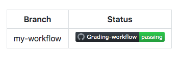

# Remove artifacts, create status badges, and configure environment protections

## Remove workflow artifacts from GitHub
By default GitHub stores any build logs and uploaded artifacts for 90 days before they are deleted. The retention period is customizable based on the type of repository and the usage limits are set for GitHub product. 

- For example if organization is reaching storage limit for GitHub artifacts and packages and management wants to remove old artifacts without increasing usage limits and blocking workflows, the solution would be to reclaim used GitHub Actions storage by deleting artifacts before they expire on GitHub. This can be done in two ways: <br>
    `Note`: <b> Both methods require write access to the repository! </b>
    1. Manually deleting artifacts from repository
        - To manually delete an artifact on GitHub, it requires to navigate to the `Actions tab`, selectiong the workflow from the left sidebar and then selecting the needed run.
        - Under `Artifacts`, delete the artifact which should be removed.
        - This procedure can also be completed using the `Artifacts REST API`. This API allows downloading and retrieving information about work artifacts.
    2. Change the default retention period
        - The default artifact and log retention peroud for repository, organization or enterprise accound can be changed.
        - Changing the tetention period will only apply to new artifacts and log files, and does not apply to existing objects.
        - The process to configure these settings is a bit different for repository, organization or enterprise:
            - [Configuring the retention period for GitHub Actions artifacts and logs in your repository](https://docs.github.com/en/repositories/managing-your-repositorys-settings-and-features/enabling-features-for-your-repository/managing-github-actions-settings-for-a-repository#configuring-the-retention-period-for-github-actions-artifacts-and-logs-in-your-repository)
            - [Configuring the retention period for GitHub Actions artifacts and logs in your organization](https://docs.github.com/en/organizations/managing-organization-settings/configuring-the-retention-period-for-github-actions-artifacts-and-logs-in-your-organization)
            - [Enforcing a policy for artifact and log retention in your enterprise](https://docs.github.com/en/enterprise-server@3.8/admin/policies/enforcing-policies-for-your-enterprise/enforcing-policies-for-github-actions-in-your-enterprise#enforcing-a-policy-for-artifact-and-log-retention-in-your-enterprise)
        
        - In addition to configured setings across a repository, organization or enterpise, it is possible to define a custom retention period for individual artifacts within the workflow file. 
        - Example of individual workflow use case using `retention-days` along with `upload-artifact` attributes:

            ```yml
            - name: 'Upload Artifact'
              uses: actions/upload-artifact@v2
              with:
                name: my-artifact
                path: my_file.txt
                retention-days: 10
            ```

## Adding a worflow status badge to repository
It's helpful to know the status of a workflow without having to visit the Actions tab to see if it successfully completed. With GitHub it can be achieved by placing the status badges of the workflow to repositories `README.md` file. By default, status badges display the workflow statuses on default branch, however it is customizable to display workflow status badges on other branches using the `branch` and event `parameters`. Adding the `branch` parameter along with the desired branch name at the end of URL will show the workflow status for that branch. It is also possible to create badge using GitHub by navigating to Actions tab and selecting a specific workflow. The `Create status badge` option will allow to generate the markdown for that workflow and set the `branch` and `event` parameters.



An example of what needs to be added to see a worfklos status badge:
```yml 

```

## Add workflow environment protections
It make sense to configure workflow envirnment with protection rules and secrets. With the protection a job won't start or access any defined secrets in the environment untill all of the environment's protection rules pass. For now protection rules and environment secrets only apply to public repositories.

There are two environment protection rules that are possible to apply to workflows within `public repositories`, `required reviewers` and `wait timer`:

-   Required reviewers allows to set a specific person or team to approve workflow jobs that reference the job's environment.
-   Wait timer can be used to `delay` a job for a specific amount of time after the job has been `triggered`.
    -   For example if it's necessary to create a workflow to a production environment that a `dev` team needs to approve before the deployement occurs, the steps would look be:
        
        1.  Create a `production environment` within the repository
        2.  Configure the required reviewers environment protection to require an approval from the specific `dev` team
        3.  Configure the specific job within the workflow for the `production` environment

    -   The repository can be created and configured from the repository's `Settings` tab under `Environments`.