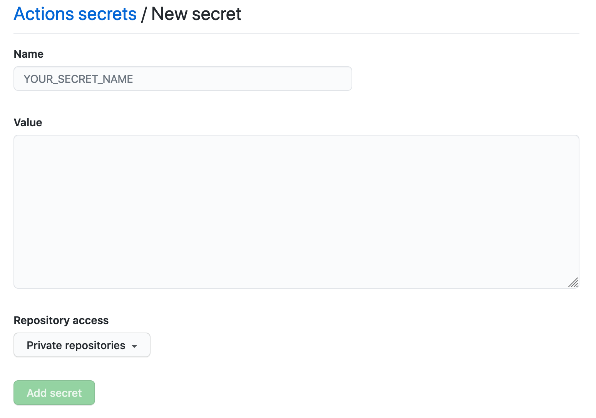
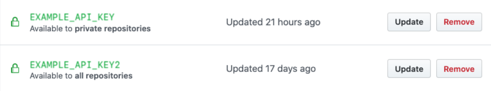

# Manage encrypted secrets
Secrets are encrypted environment variables that can be created to store tokens, credentials, or any other type of sensitive information in GitHub Action workflows that action might rely on. Once created, they become available to use in the workflows and actions that have access to the organization, repository or repository environment where they are stored.

## Secrets at Organization Level

To create a secret at organization level, go to organization Settings and select Secrets > New organization secret in the left sidebar. In the screen that appears, enter a name and a value and choose repository access policy for the secret:


The access policy appears inderneath the secret in the secret list once it is saved. The `Update` button allows to cgange the details on the configured permissions that secret have.


Setting a secret at this level is an excellent idea if that secret should be available to all around the organization. Insead of having it in every single repository, it is now accessable from a single place on the organization level.

## Secrets at Repository Level
To create a secret at repository level, go to repository `Settings` and select `Secrets` > `New repository secret` in the left sidebar. In the screen that appears, enter a name and a value for new secret. It looks exactly similar to organization level, but the secret is `ONLY` for the repository and doesn't have "repository access" policy permissions.

## Accessing encrtyped secrets within Actions and Workflows

### In workflows
In order to access an `encrypted secret` in a `workflow` users must use `secrets` context in a workflow file:
```yml
steps:
  - name: Hello world action
    with: # Set the secret as an input
      super_secret: ${{ secrets.SuperSecret }}
    env: # Or as an environment variable
      super_secret: ${{ secrets.SuperSecret }}
```

### In actions
In order to access an `encrypted secret` in an `action` users must specify secret as an `input` parameter in the `action.yml` metadata file:

```yml
inputs:
  super_secret:
    description: 'A super secret'
    required: true
```
E.g. that means that when secret is created, an action can only get the secrets as input. In this case the action code could
read the value of the input using the `INPUT_SUPER_SECRET` environment variable.